<div>

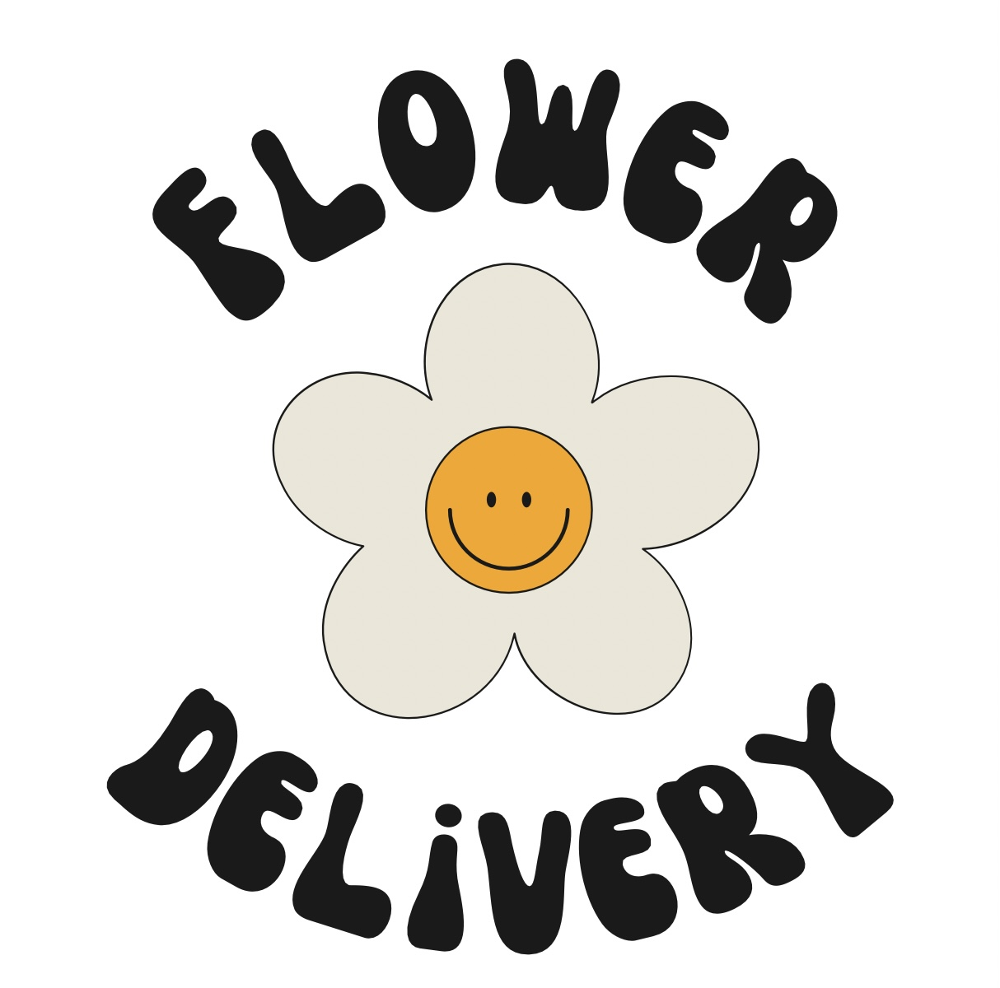                                                                                                    
</div>

# 꽃배달서비스


# 서비스 시나리오


기능적 요구사항
1. 고객이 꽃을 선택하여 주문한다
1. 고객이 결제한다
1. 결제가 되면 주문 내역이 입점상점주인에게 전달된다
1. 배달(Online)으로 주문한 경우 택배사로 전달된다.
1. 직접수령(Offline)으로 주문한 경우 배달완료 처리한다.
1. 고객이 주문을 취소할 수 있다
1. 주문이 취소되면 배달이 취소된다
1. 고객이 주문상태를 중간중간 조회한다
1. 주문상태가 바뀔 때 마다 카톡으로 알림을 보낸다 (미구현)

비기능적 요구사항
1. 트랜잭션
    1. 결제가 되지 않은 주문건은 아예 거래가 성립되지 않아야 한다 
1. 장애격리
    1. 상점관리 기능이 수행되지 않더라도 주문은 365일 24시간 받을 수 있어야 한다  Async (event-driven), Eventual Consistency
    1. 결제시스템이 과중되면 사용자를 잠시동안 받지 않고 결제를 잠시후에 하도록 유도한다  Circuit breaker, fallback
1. 성능
    1. 고객이 자주 상점관리에서 확인할 수 있는 배달상태를 주문시스템(프론트엔드)에서 확인할 수 있어야 한다  CQRS
    1. 배달상태가 바뀔때마다 카톡 등으로 알림을 줄 수 있어야 한다  Event driven (미구현)


# 체크포인트

- 분석 설계


  - 이벤트스토밍: 
    - 스티커 색상별 객체의 의미를 제대로 이해하여 헥사고날 아키텍처와의 연계 설계에 적절히 반영하고 있는가?
    - 각 도메인 이벤트가 의미있는 수준으로 정의되었는가?
    - 어그리게잇: Command와 Event 들을 ACID 트랜잭션 단위의 Aggregate 로 제대로 묶었는가?
    - 기능적 요구사항과 비기능적 요구사항을 누락 없이 반영하였는가?    

  - 서브 도메인, 바운디드 컨텍스트 분리
    - 팀별 KPI 와 관심사, 상이한 배포주기 등에 따른  Sub-domain 이나 Bounded Context 를 적절히 분리하였고 그 분리 기준의 합리성이 충분히 설명되는가?
      - 적어도 3개 이상 서비스 분리
    - 폴리글랏 설계: 각 마이크로 서비스들의 구현 목표와 기능 특성에 따른 각자의 기술 Stack 과 저장소 구조를 다양하게 채택하여 설계하였는가?
    - 서비스 시나리오 중 ACID 트랜잭션이 크리티컬한 Use 케이스에 대하여 무리하게 서비스가 과다하게 조밀히 분리되지 않았는가?
  - 컨텍스트 매핑 / 이벤트 드리븐 아키텍처 
    - 업무 중요성과  도메인간 서열을 구분할 수 있는가? (Core, Supporting, General Domain)
    - Request-Response 방식과 이벤트 드리븐 방식을 구분하여 설계할 수 있는가?
    - 장애격리: 서포팅 서비스를 제거 하여도 기존 서비스에 영향이 없도록 설계하였는가?
    - 신규 서비스를 추가 하였을때 기존 서비스의 데이터베이스에 영향이 없도록 설계(열려있는 아키택처)할 수 있는가?
    - 이벤트와 폴리시를 연결하기 위한 Correlation-key 연결을 제대로 설계하였는가?
    
- 구현
  - [DDD] 분석단계에서의 스티커별 색상과 헥사고날 아키텍처에 따라 구현체가 매핑되게 개발되었는가?
    - Entity Pattern 과 Repository Pattern 을 적용하여 JPA 를 통하여 데이터 접근 어댑터를 개발하였는가
    - [헥사고날 아키텍처] REST Inbound adaptor 이외에 gRPC 등의 Inbound Adaptor 를 추가함에 있어서 도메인 모델의 손상을 주지 않고 새로운 프로토콜에 기존 구현체를 적응시킬 수 있는가?
    - 분석단계에서의 유비쿼터스 랭귀지 (업무현장에서 쓰는 용어) 를 사용하여 소스코드가 서술되었는가?
  - Request-Response 방식의 서비스 중심 아키텍처 구현
    - 마이크로 서비스간 Request-Response 호출에 있어 대상 서비스를 어떠한 방식으로 찾아서 호출 하였는가? (Service Discovery, REST, FeignClient)
    - 서킷브레이커를 통하여  장애를 격리시킬 수 있는가?
  - 이벤트 드리븐 아키텍처의 구현
    - 카프카를 이용하여 PubSub 으로 하나 이상의 서비스가 연동되었는가?
    - Correlation-key:  각 이벤트 건 (메시지)가 어떠한 폴리시를 처리할때 어떤 건에 연결된 처리건인지를 구별하기 위한 Correlation-key 연결을 제대로 구현 하였는가?
    - Message Consumer 마이크로서비스가 장애상황에서 수신받지 못했던 기존 이벤트들을 다시 수신받아 처리하는가?
    - Scaling-out: Message Consumer 마이크로서비스의 Replica 를 추가했을때 중복없이 이벤트를 수신할 수 있는가
    - CQRS: Materialized View 를 구현하여, 타 마이크로서비스의 데이터 원본에 접근없이(Composite 서비스나 조인SQL 등 없이) 도 내 서비스의 화면 구성과 잦은 조회가 가능한가?

- 운영
  - SLA 준수
    - 셀프힐링: Liveness Probe 를 통하여 어떠한 서비스의 health 상태가 지속적으로 저하됨에 따라 어떠한 임계치에서 pod 가 재생되는 것을 증명할 수 있는가?
    - 서킷브레이커, 레이트리밋 등을 통한 장애격리와 성능효율을 높힐 수 있는가?
    - 오토스케일러 (HPA) 를 설정하여 확장적 운영이 가능한가?
    - 모니터링, 앨럿팅: 
  - 무정지 운영 CI/CD (10)
    - Readiness Probe 의 설정과 Rolling update을 통하여 신규 버전이 완전히 서비스를 받을 수 있는 상태일때 신규버전의 서비스로 전환됨을 siege 등으로 증명 
    - Contract Test :  자동화된 경계 테스트를 통하여 구현 오류나 API 계약위반를 미리 차단 가능한가?


# 분석/설계


## Event Storming 결과
* MSAEz 로 모델링한 이벤트스토밍 결과:  https://labs.msaez.io/#/storming/i1ds8SUYDcQdv1SdsD4gQ6olJ2t1/977394fe0ea4eda43c3214f1c9172df5


### 이벤트 도출


### 부적격 이벤트 탈락


    - 과정중 도출된 잘못된 도메인 이벤트들을 걸러내는 작업을 수행함

    - 주문시>메뉴카테고리선택됨, 주문시>메뉴검색됨 :  UI 의 이벤트이지, 업무적인 의미의 이벤트가 아니라서 제외

### 액터, 커맨드 부착하여 읽기 좋게


### 어그리게잇으로 묶기


    - app의 Order, store 의 주문처리, 결제의 결제이력은 그와 연결된 command 와 event 들에 의하여 트랜잭션이 유지되어야 하는 단위로 그들 끼리 묶어줌

### 바운디드 컨텍스트로 묶기


    - 도메인 서열 분리 
        - Core Domain:  app(front), store : 없어서는 안될 핵심 서비스이며, 연견 Up-time SLA 수준을 99.999% 목표, 배포주기는 app 의 경우 1주일 1회 미만, store 의 경우 1개월 1회 미만
        - Supporting Domain:   marketing, customer : 경쟁력을 내기위한 서비스이며, SLA 수준은 연간 60% 이상 uptime 목표, 배포주기는 각 팀의 자율이나 표준 스프린트 주기가 1주일 이므로 1주일 1회 이상을 기준으로 함.
        - General Domain:   pay : 결제서비스로 3rd Party 외부 서비스를 사용하는 것이 경쟁력이 높음 (핑크색으로 이후 전환할 예정)

### 폴리시 부착 (괄호는 수행주체, 폴리시 부착을 둘째단계에서 해놔도 상관 없음. 전체 연계가 초기에 드러남)


### 폴리시의 이동과 컨텍스트 매핑 (점선은 Pub/Sub, 실선은 Req/Resp)


### 완성된 1차 모형


### 1차 완성본에 대한 기능적/비기능적 요구사항을 커버하는지 검증


    - 고객이 메뉴를 선택하여 주문한다 (ok)
    - 고객이 결제한다 (ok)
    - 주문이 되면 주문 내역이 입점상점주인에게 전달된다 (ok)
    - 상점주인이 확인하여 포장하고 배달 출발한다 (ok)


    - 고객이 주문을 취소할 수 있다 (ok)
    - 주문이 취소되면 배달이 취소된다 (ok)
    - 고객이 주문상태를 중간중간 조회한다 (View-green sticker 의 추가로 ok) 
    - 주문상태가 바뀔 때 마다 알림을 보낸다 (?)


### 비기능 요구사항에 대한 검증


    - 마이크로 서비스를 넘나드는 시나리오에 대한 트랜잭션 처리
        - 고객 주문시 결제처리:  결제가 완료되지 않은 주문은 절대 받지 않는다는 경영자의 오랜 신념(?) 에 따라, ACID 트랜잭션 적용. 주문와료시 결제처리에 대해서는 Request-Response 방식 처리
        - 결제 완료시 점주연결 및 배송처리:  App(front) 에서 Store 마이크로서비스로 주문요청이 전달되는 과정에 있어서 Store 마이크로 서비스가 별도의 배포주기를 가지기 때문에 Eventual Consistency 방식으로 트랜잭션 처리함.
        - 나머지 모든 inter-microservice 트랜잭션: 주문상태, 배달상태 등 모든 이벤트에 대해 카톡을 처리하는 등, 데이터 일관성의 시점이 크리티컬하지 않은 모든 경우가 대부분이라 판단, Eventual Consistency 를 기본으로 채택함.


### 최종 Event Storming 작성 내용
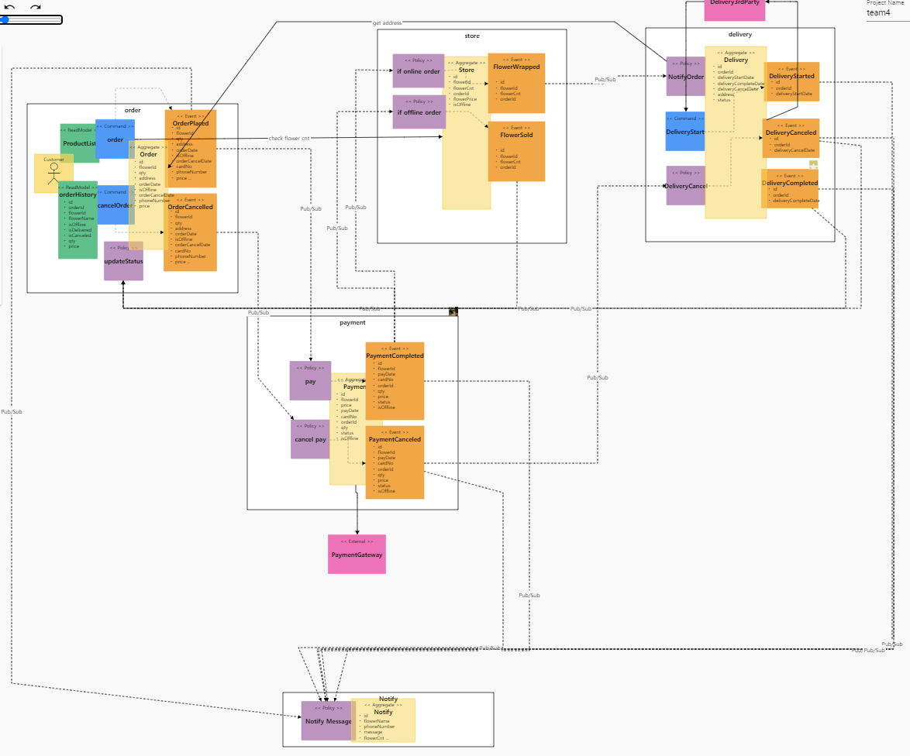


# 구현:

분석/설계 단계에서 도출된 헥사고날 아키텍처에 따라, 각 BC별로 대변되는 마이크로 서비스들을 스프링부트로 구현하였다. 

## Service Port

| microSerivce | portNum |
|:-------------|:--------|
| deliveries    | 8081   |
| orders        | 8082   |
| stores        | 8083   |
| payments      | 8084   |
| notify        | 8085   |
※ notify는 미구현


```bash

cd order
mvn spring-boot:run

cd payment
mvn spring-boot:run 

cd store
mvn spring-boot:run  

cd delivery
mvn spring-boot:run 

```

## DDD 의 적용

- 각 서비스내에 도출된 핵심 Aggregate Root 객체를 Entity 로 선언하였다: (예시는 order 마이크로 서비스). 

```java
package team.domain;

import team.domain.OrderPlaced;
import team.OrderApplication;
import javax.persistence.*;
import java.util.List;
import lombok.Data;
import java.util.Date;

@Entity
@Table(name="Order_table")
@Data

public class Order  {
    @Id
    @GeneratedValue(strategy=GenerationType.AUTO)
    
    private Long id;    
    private Long flowerId;
    private Integer qty;
    private String address;
    private Date orderDate;
    private Boolean isOffline;
    private Date orderCancelDate;
    private String phoneNumber;
    private Double price;

    @PostPersist
    public void onPostPersist(){

        // Get request from Store
        team.external.Store store =
           OrderApplication.applicationContext.getBean(team.external.StoreService.class)
           .getStore(getFlowerId());

        if (store.getFlowerCnt() < getQty()) throw new RuntimeException("Out of stock!");

        OrderPlaced orderPlaced = new OrderPlaced(this);
        orderPlaced.publishAfterCommit();

    }

    public static OrderRepository repository(){
        OrderRepository orderRepository = OrderApplication.applicationContext.getBean(OrderRepository.class);
        return orderRepository;
    }

    public void cancelOrder(){
        OrderCancelled orderCancelled = new OrderCancelled(this);
        orderCancelled.publishAfterCommit();

    }

```

- Entity Pattern 과 Repository Pattern 을 적용하여 JPA 를 통하여 다양한 데이터소스 유형 (RDB or NoSQL) 에 대한 별도의 처리가 없도록 데이터 접근 어댑터를 자동 생성하기 위하여 Spring Data REST 의 RestRepository 를 적용하였다
```

package team.domain;

import team.domain.*;
import org.springframework.data.repository.PagingAndSortingRepository;
import org.springframework.data.rest.core.annotation.RepositoryRestResource;

@RepositoryRestResource(collectionResourceRel="orders", path="orders")
public interface OrderRepository extends PagingAndSortingRepository<Order, Long>{

}
```


# 적용 후 REST API 의 테스트

## 1. Saga Pattern (Pub/Sub)
### a. 배달주문처리 
#### (isoffline=false)


```
OrderPlaced -> PaymentCompleted -> FlowerWapped -> DeliveryStarted
```


### b. 방문수령처리 
#### (isoffline=true)


```
OrderPlaced -> PaymentCompleted -> FlowerSold
```


## 2. Compensation / Correlation 
### 주문취소처리


- Microservice Flows
```
OrderCancelled -> PaymentCanceled -> DeliveryCanceled
```


## 3. CQRS 
### 주문 상태 확인
``` 
주문관련 변경 내용(주문취소)이 order 서비스에 있는 orderHistories Read Model에 저장되어 있음 
```


## 4. Request / Response 
### a. 배송주소확인(REQ/RES)

```
- Feign Client를 활용한 REST get으로 Delivery Service에 필요한 address 정보를 다른 서비스(order)로 부터 가져옴
```
```java
@FeignClient(name = "order", url = "${api.url.order}")
public interface OrderService {
    @RequestMapping(method= RequestMethod.GET, path="/orders/{id}")
    public Order getOrder(@PathVariable("id") Long id);
}
```

### b. order에서 store의 flowerCnt(재고)를 체크하여 에러처리(out of stock)


     
### 동기식 호출 과 Fallback 처리
                  
분석단계에서의 조건 중 하나로 주문(order) -> 상점(store) 간의 호출은 동기식 일관성을 유지하는 트랜잭션으로 처리하기로 하였다. 

- 주문을 받은 직후(@PostPersist) 재고를 확인하고 주문 완료 처리
```
# Order.java (Entity)

@PostPersist
    public void onPostPersist(){

        // Get request from Store
        team.external.Store store =
           OrderApplication.applicationContext.getBean(team.external.StoreService.class)
           .getStore(getFlowerId());

        if (store.getFlowerCnt() < getQty()) throw new RuntimeException("Out of stock!");

        OrderPlaced orderPlaced = new OrderPlaced(this);
        orderPlaced.publishAfterCommit();


- 동기식 호출에서는 호출 시간에 따른 타임 커플링이 발생하며, 결제 시스템이 장애가 나면 주문도 못받는다는 것을 확인:


```


# 운영


## 5. Circuit Breaker

Istio DestinationRule 설정을 통해, 장애가 감지된 서비스를 서비스 대상에서 일정시간 동안 제외(Pool Ejection)
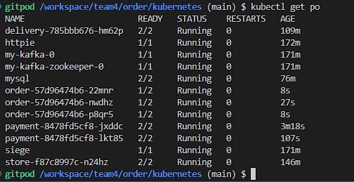

Circuit Breaker는 아래와 같이 설치
```bash
kubectl apply -f - << EOF
  apiVersion: networking.istio.io/v1alpha3
  kind: DestinationRule
  metadata:
    name: order
    namespace: default
  spec:
    host: order
    trafficPolicy:
      outlierDetection:
        consecutive5xxErrors: 1
        interval: 1s
        baseEjectionTime: 3m
        maxEjectionPercent: 100
EOF
```

테스트 

1. 새로운 터미널에서 order 컨테이너 하나에 접속하여 명시적으로 5xx 오류를 발생 시킨다.
```
kubectl exec -it pod/order-57d96474b6-22mnr  -n default -c order -- /bin/sh
apk update
apk add httpie
http http://localhost:8080/actuator/health
http PUT http://localhost:8080/actuator/down
```
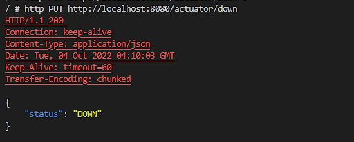

2. 동시에 새로운 터미널에서 siege 실행 하면 오류가 발생
```
kubectl exec -it pod/siege -- /bin/bash
siege -c15 -t30S -v -y http://order:8080/orders
```
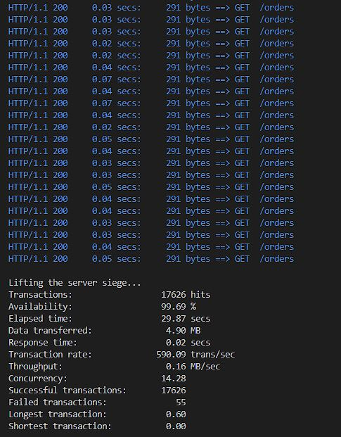

3. 다시 siege 실행 하면 오류가 발생하지 않음 (circuit breaker 작동)
```
siege -c15 -t30S -v -y http://order:8080/orders
```

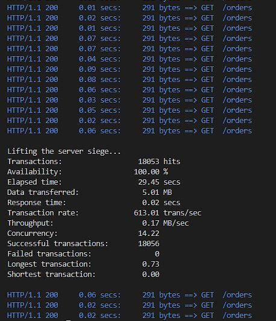


## 6. Gateway / Ingress
- Igress Controler 설치
```bash
helm repo add stable https://charts.helm.sh/stable
helm repo add ingress-nginx https://kubernetes.github.io/ingress-nginx
helm repo update
kubectl create namespace ingress-basic
```
```bash
helm install nginx-ingress ingress-nginx/ingress-nginx --namespace=ingress-basic
```
- 설치 점검
```bash
kubectl get all --namespace=ingress-basic
```
- shop Ingress yaml 
```yaml
apiVersion: "extensions/v1beta1"
kind: "Ingress"
metadata: 
  name: "shop-ingress"
  annotations: 
    kubernetes.io/ingress.class: "nginx"
spec: 
  rules: 
    - 
      http: 
        paths: 
          - 
            path: /orders
            pathType: Prefix
            backend: 
              serviceName: order
              servicePort: 8080
          - 
            path: /deliveries
            pathType: Prefix
            backend: 
              serviceName: delivery
              servicePort: 8080
          - 
            path: /stores
            pathType: Prefix
            backend: 
              serviceName: store
              servicePort: 8080
          - 
            path: /deliveries
            pathType: Prefix
            backend: 
              serviceName: delivery
              servicePort: 8080
          - 
            path: /payments
            pathType: Prefix
            backend: 
              serviceName: payment
              servicePort: 8080
```

### delivery 서비스 
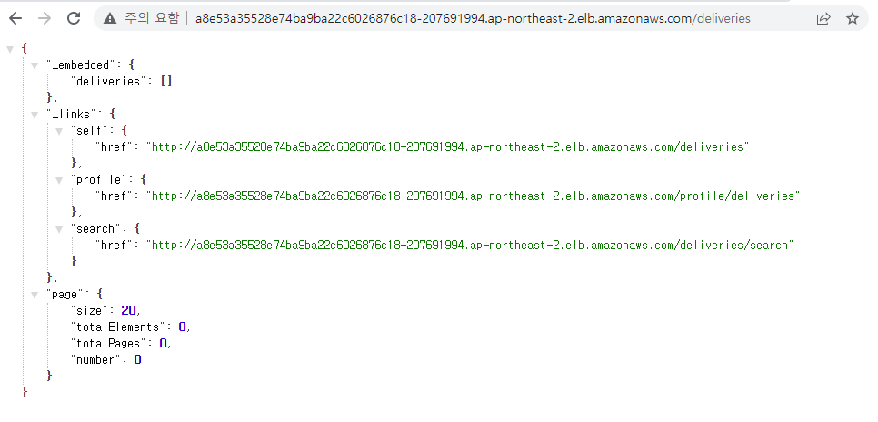


### order 서비스         
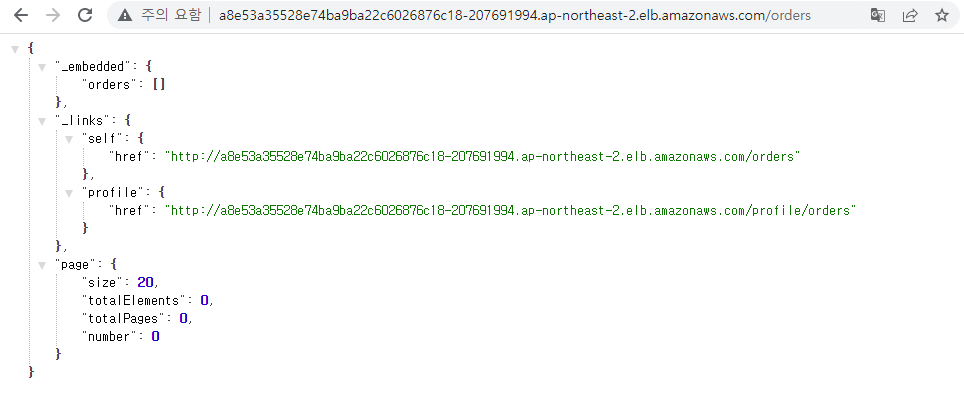

### payment 서비스                     
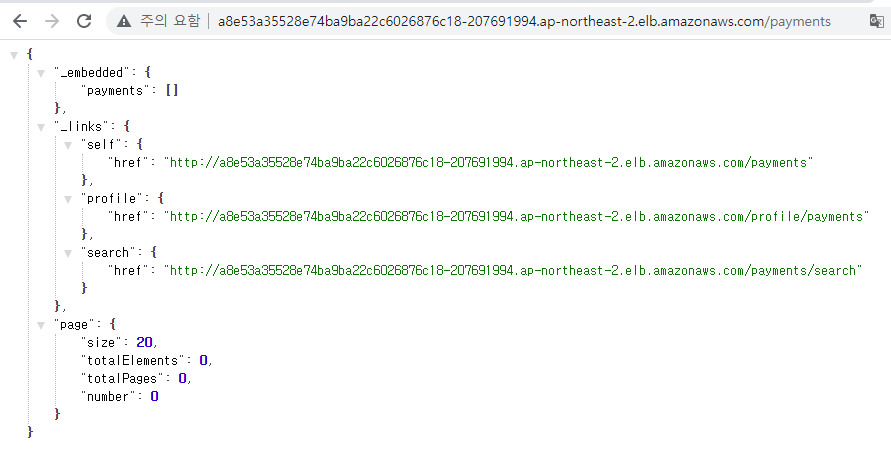

### store 서비스                  
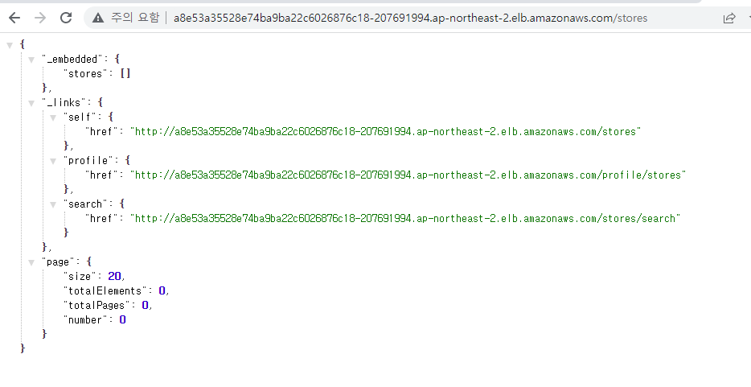
                       

## 7. Deploy

- AWS EKS에 배포되어 있는 pods

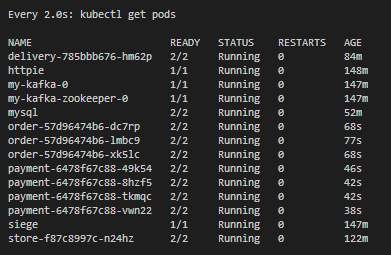


## 8. Autoscale (HPA)
- autoScale 설정
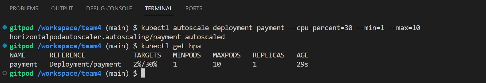

- Load 발생 후, HPA 설정에 따라서 POD가 자동 Scale Out 됩니다.
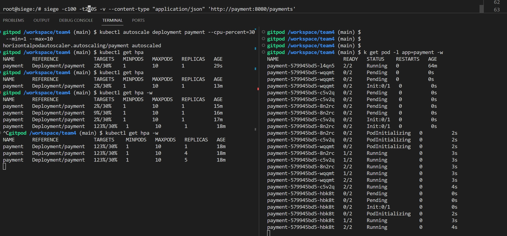

- Kiali에서 증설된 POD를 추가로 확인할 수 있습니다.
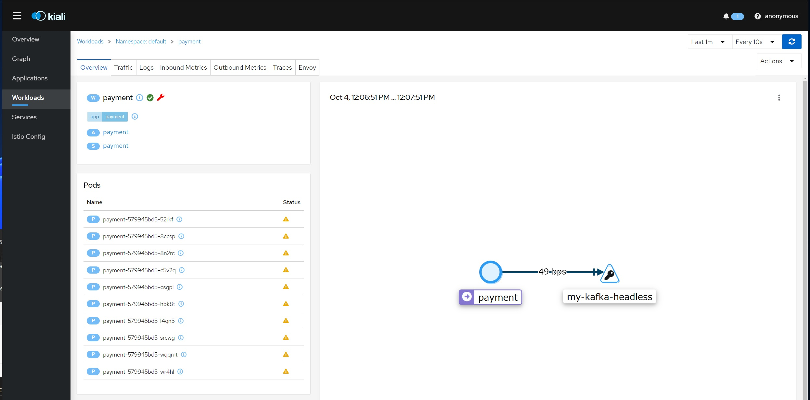

- 증설 되는 동안의 Request 에 결과는 다음과 같이 정상 처리되었습니다.
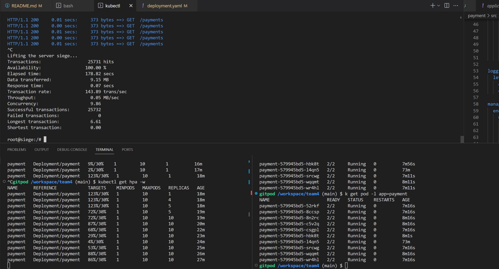


## 9. Zero-downtime deploy (Readiness Probe)
- Readiness 설정 전에 Deployment.yml 입니다.
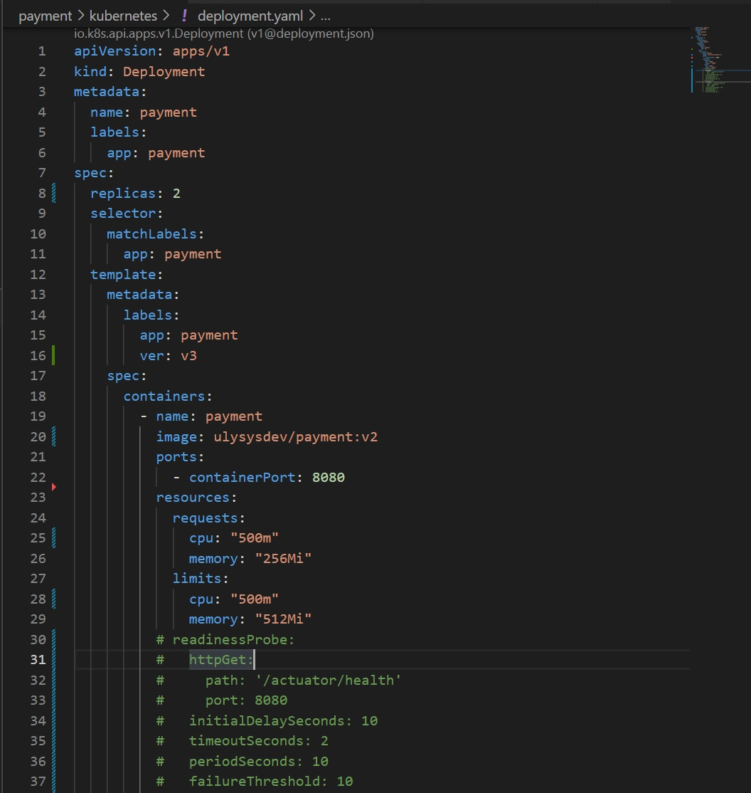

- Siege 를 사용하여 Req 를 보내면, 일부 Fail이 나고 있습니다.
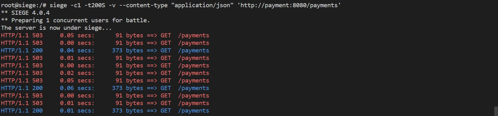

- Deployment.yml에 READINESS 를 설정 합니다.
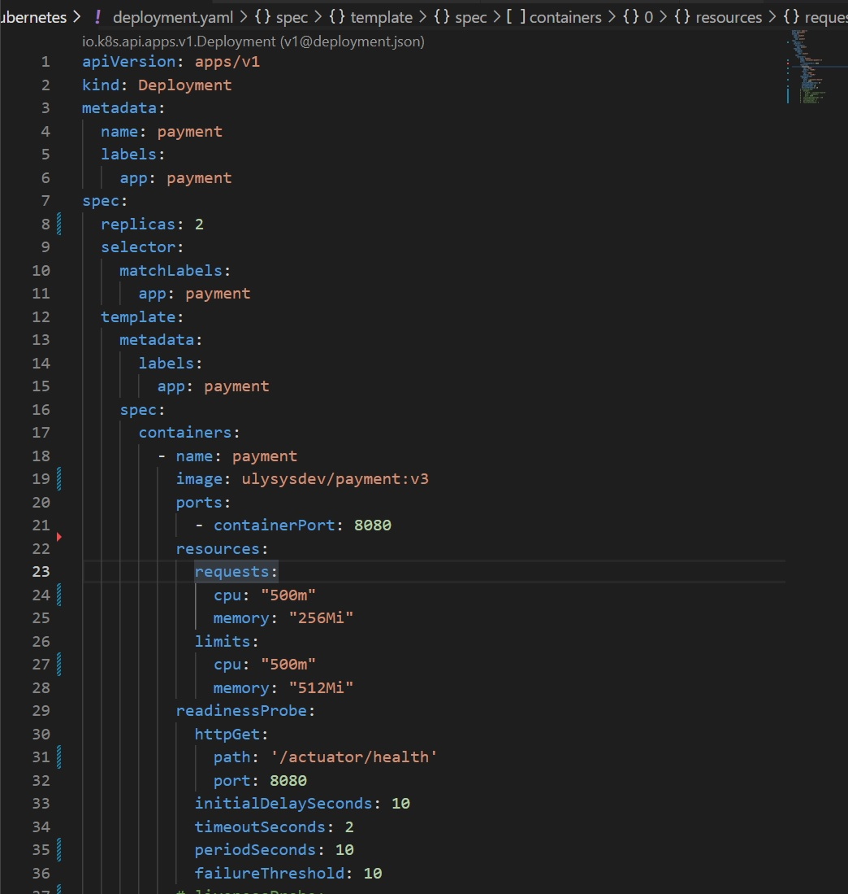

- 다시 Deployment 를 적용 후 Siege를 사용하여 Req 를 보내면 모두 200 OK 가 됩니다.
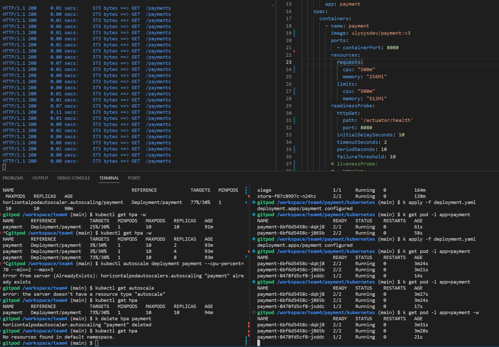

- Siege의 결과는 다음과 같습니다.
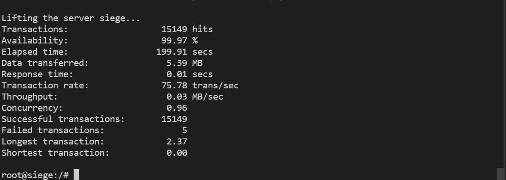


## 10. Secret
- secret.yaml 파일 생성


```yaml
apiVersion: v1
kind: Secret
metadata:
  name: team4-pass
type: Opaque
data:
  password: dGVhbTRmaWdodGluZw==
```

- 해당 secret을 사용할 mysql pod용 yaml 파일 생성

   secretkey는 team4-pass

```yaml
apiVersion: v1
kind: Pod
metadata:
  name: mysql
  labels:
    name: lbl-k8s-mysql
spec:
  containers:
  - name: mysql
    image: mysql:latest
    env:
    - name: MYSQL_ROOT_PASSWORD
      valueFrom:
        secretKeyRef:
          name: team4-pass
          key: password
    ports:
    - name: mysql
      containerPort: 3306
      protocol: TCP
    volumeMounts:
    - name: k8s-mysql-storage
      mountPath: /var/lib/mysql
  volumes:
  - name: k8s-mysql-storage
    emptyDir: {}
```

- 현재 secrets없음 확인

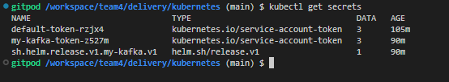

- secret.yaml 적용

   team4-pass 가 생성됨을 확인

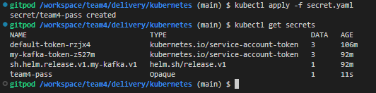


- mysql 파트 생성(secret키 사용할 app)

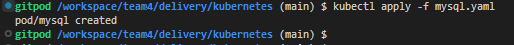

- pod 생성됨을 확인

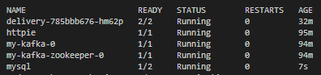

- mysql pod에 들어가서 해당 secret 키 내용 확인 

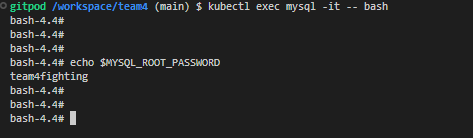

```
team4fighting이라는 secret으로 된 password 확인 가능
```


## 11. Liveness 설정
- spring cloud actuator 를 활성화 합니다.
```java
## payment/src/main/java/team/CustomHealthIndicator.java
package team;

import java.util.concurrent.atomic.AtomicReference;

import org.springframework.boot.actuate.health.Health;
import org.springframework.boot.actuate.health.HealthIndicator;
import org.springframework.boot.actuate.health.Status;
import org.springframework.web.bind.annotation.PutMapping;
import org.springframework.web.bind.annotation.RequestMapping;
import org.springframework.web.bind.annotation.RestController;

@RestController
@RequestMapping("/actuator")
public class CustomHealthIndicator implements HealthIndicator {

    private final AtomicReference<Health> health = new AtomicReference<>(Health.up().build());

    @Override
    public Health health() {
        return health.get();
    }

    @PutMapping("/up")
    public Health up() {
        Health up = Health.up().build();
        this.health.set(up);
        return up;
    }

    @PutMapping("/down")
    public Health down() {
        Health down = Health.down().build();
        this.health.set(down);
        return down;
    }

    @PutMapping("/maintenance")
    public Health maintenance() {
        Health maintenance = Health.status(new Status("MAINTENANCE")).build();
        this.health.set(maintenance);
        return maintenance;
    }
}
```
- application.xml 에 actuator 설정을 추가 합니다.
```yaml
## payment/src/main/resources/application.yml
management:
  health:
    status:
      order: DOWN, MAINTENANCE, UNKOWN, UP
      http-mapping:
        DOWN: 503
        MAINTENANCE: 503
        UNKNOWN: 200
        UP: 200
  endpoints:
    web:
      exposure:
        include:
          - "*"
```
- 위 설정의 Application 을 재 docker build 하고 아래와 Deployment.yml을 통해서 배포 합니다.
- deployment-payment.yaml 에 liveness 설정 추가
  - 시작 후 120 초 이후 
  - timeout 이 2초 마다 5초 간격으로 probe 하고
  - 실패가 5번 발생하면 liveness 가 발동 합니다.
```yaml
apiVersion: apps/v1
kind: Deployment
metadata:
  name: payment
  labels:
    app: payment
spec:
  replicas: 2
  selector:
    matchLabels:
      app: payment
  template:
    metadata:
      labels:
        app: payment
        ver: v3
    spec:
      containers:
        - name: payment
          image: ulysysdev/payment:v5
          ports:
            - containerPort: 8080
          resources:
            requests:
              cpu: "500m"
              memory: "256Mi"
            limits:
              cpu: "500m"
              memory: "512Mi"
          readinessProbe:
            httpGet:
              path: '/actuator/health'
              port: 8080
            initialDelaySeconds: 10
            timeoutSeconds: 2
            periodSeconds: 10
            failureThreshold: 10
          livenessProbe:
            httpGet:
              path: '/actuator/health'              
              port: 8080
            initialDelaySeconds: 120
            timeoutSeconds: 2
            periodSeconds: 5
            failureThreshold: 5
```
- payment 배포 후 pod 는 정상 동작 하고 있습니다.
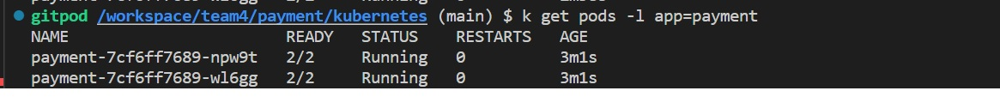

- 해당 Pod 로 로그인하여 수동으로 서비스 상태를 down 시킵니다.
  - 정상 상태 확인
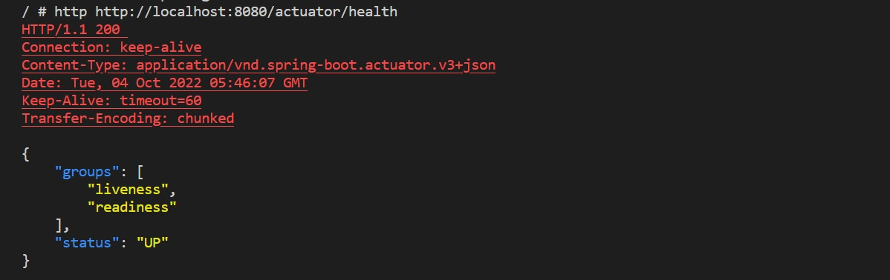
  - 수동으로 container를 down 시킵니다.
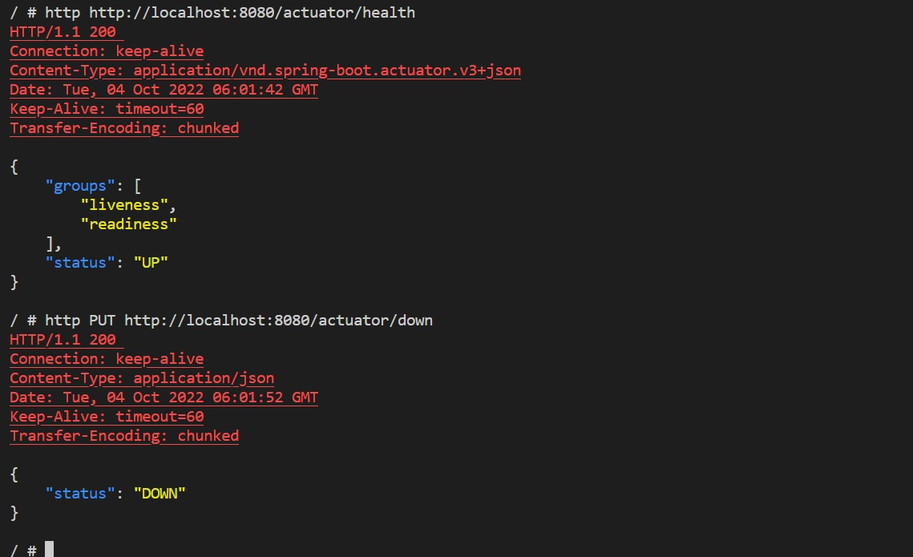

- 위 상태 변화에 따라서 POD 상태는 다음과 같이 변경된 후 재기동 됩니다.
  - RESTARTS 에 1 이 추가 되었습니다.
  - 자동 재기동으로 POD의 모든 상태가 정상(Running) 으로 Self-Healing 되었습니다.
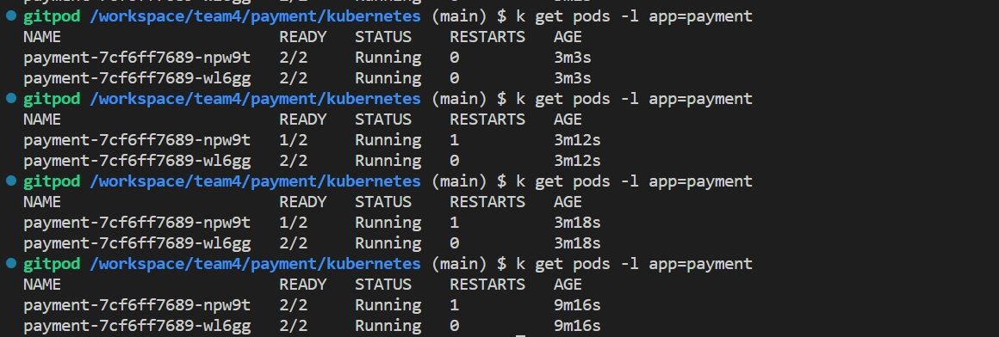
---

